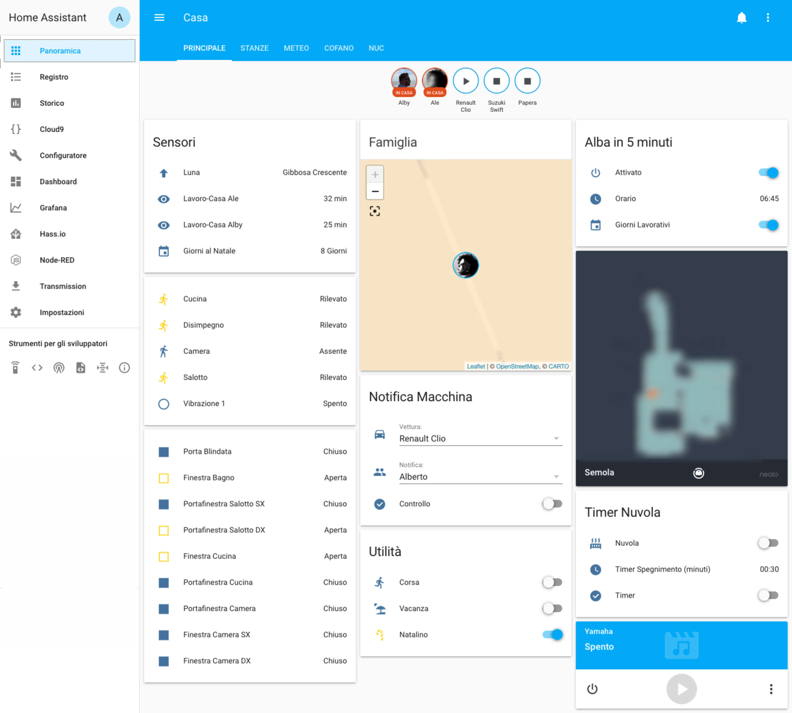
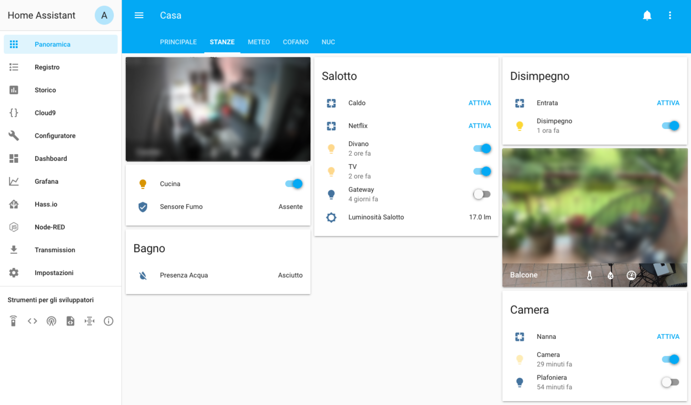
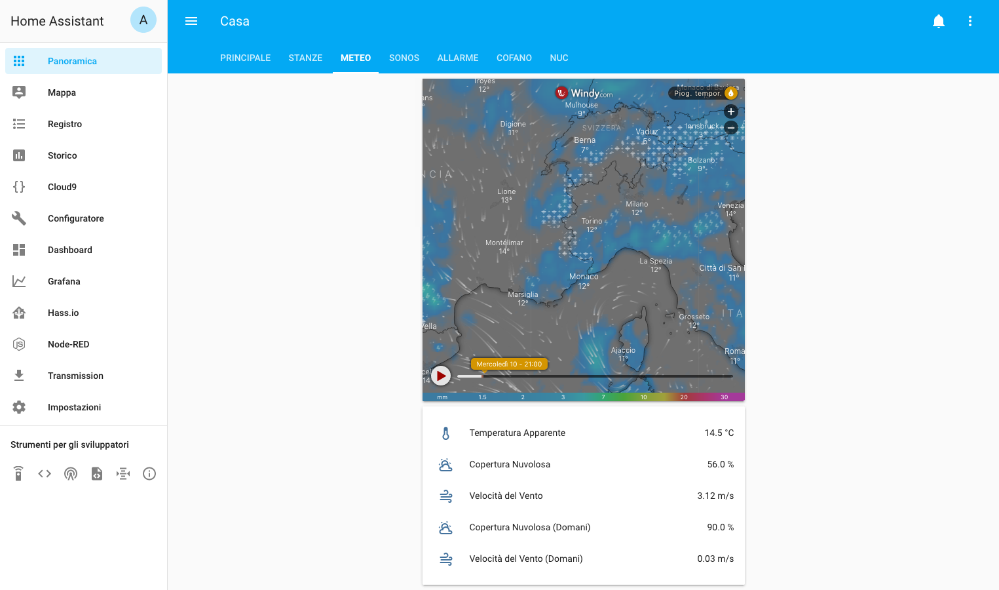
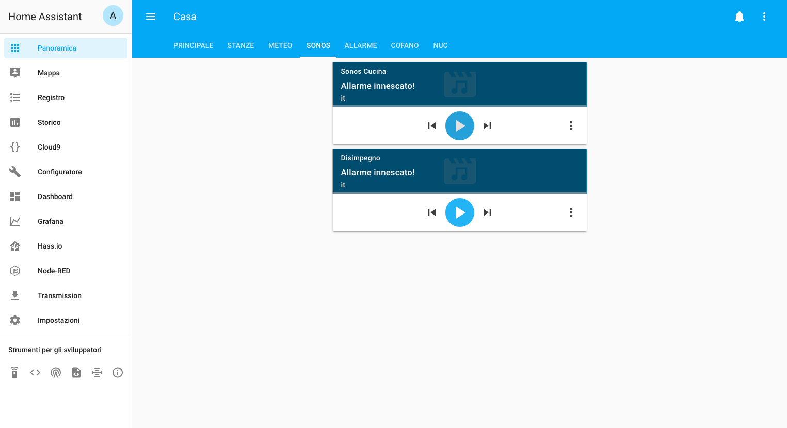
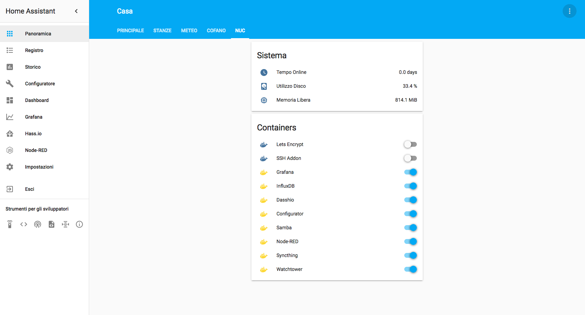

# Home Assistant Repository Backup 

Questo è semplicemente il backup della mia cartella config di [hass.io](https://www.home-assistant.io).

* Le immagini qui sotto sono aggiornate meno frequentemente del resto, potrebbero esserci discrepanze.

* Trovate maggiori informazioni sui Packages che ho scritto nel [readme](https://github.com/JohnnyZeta/hassio/tree/master/packages) della cartella relativa.

Su [questa pagina](https://github.com/JohnnyZeta/hassio/tree/master/devices.md) trovate un ripilogo dei dispositivi smart che utilizzo con Home Assistant.

## Principale

## Stanze

## Meteo

## Cofano

## NUC

