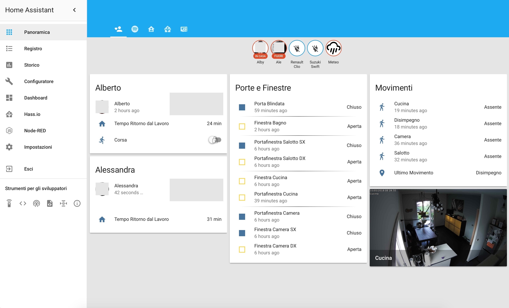
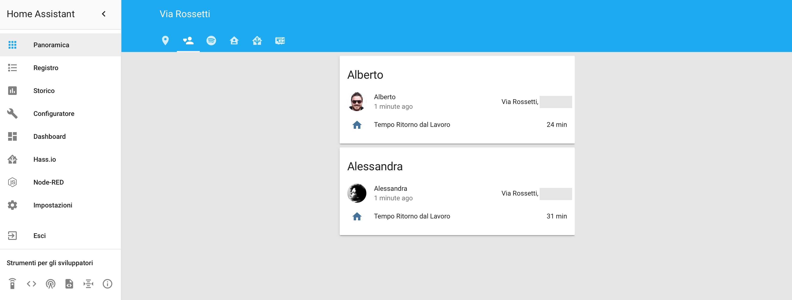
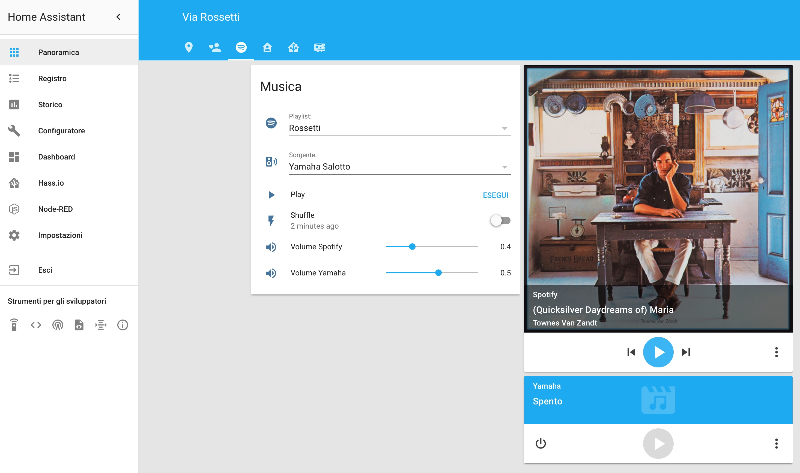
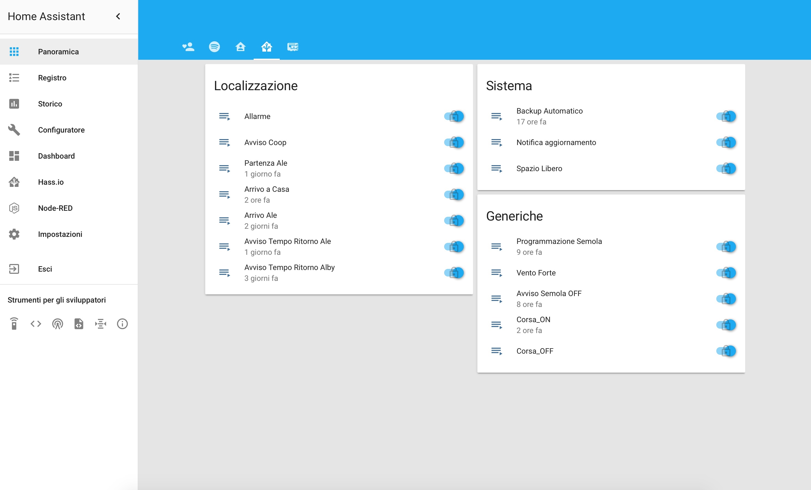
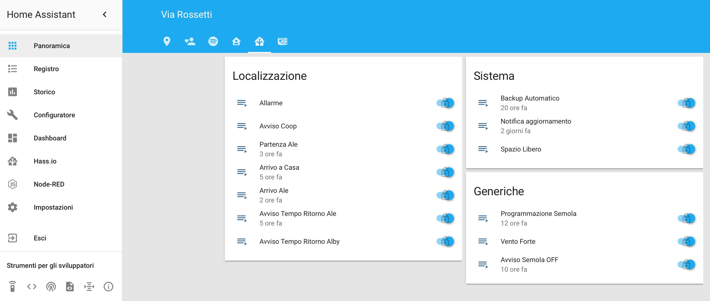

# Home Assistant Repository Backup

Questo è semplicemente il backup della mia cartella config di [hass.io](https://www.home-assistant.io).

## Home

## Persone

## Media

## Stanze

## Automazioni

## Altro

